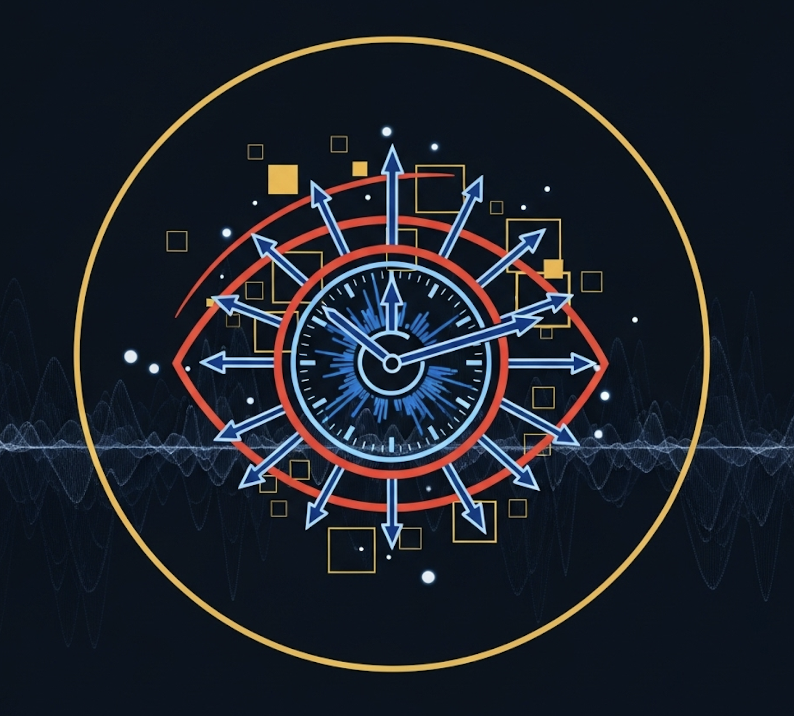
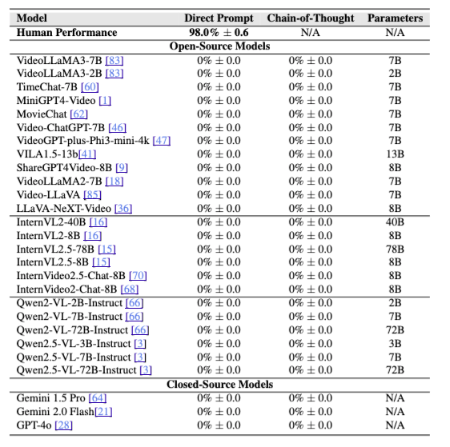

#  **Time Blindness: Why Video-Language Models Can't See What Humans Can?**


[Ujjwal Upadhyay](https://ujjwal9.com)<sup> * </sup> &nbsp;
[Mukul Ranjan](https://mukul54.github.io/)<sup> * </sup> &nbsp;
[Zhiqiang Shen](https://zhiqiangshen.com/) &nbsp;
[Mohamed Elhoseiny](https://www.mohamed-elhoseiny.com/)

<br>
<br>
<sup>*</sup>Equal Contribution
<br>
<br>

[](https://arxiv.org/abs/2505.24867v1) 
[](https://timeblindness.github.io/) 
[](https://github.com/TimeBlindness/time-blindness/issues) 
[](https://github.com/TimeBlindness/time-blindness/stargazers)
[](https://github.com/TimeBlindness/time-blindness/blob/main/LICENSE)
<br>

## 📌 Table of Contents
- [📖 Overview](#-overview)
- [🌟 Key Highlights](#-key-highlights)
- [📊 SpookyBench Dataset](#-spookybench-dataset)
- [🎯 Benchmark Results](#-benchmark-results)
- [📸 Task Examples](#-task-examples)
- [🔬 Temporal Encoding Framework](#-temporal-encoding-framework)
- [⚙️ Installation & Usage](#-installation--usage)
- [📜 Citation](#-citation)

---
  
## 📖 **Overview**  

Current **🤖 Video-Vision Language Models (Video-VLMs)** excel at spatial understanding but suffer from **⏰ "time blindness"** - a critical inability to process purely temporal patterns. While humans effortlessly recognize information encoded in temporal sequences with **98% accuracy**, state-of-the-art models including **GPT-4o, Gemini 2.0, and Qwen-VL achieve 0% accuracy** on the same tasks.

We introduce **👻 SpookyBench**, the first benchmark designed to isolate and evaluate pure temporal understanding by encoding information exclusively through temporal sequences of noise-like frames. This exposes a fundamental limitation in current video understanding architectures that over-rely on frame-level spatial features.

---

### 🌟 **Key Highlights**  
✅ **First benchmark to isolate purely temporal reasoning** without spatial shortcuts  
✅ **451 carefully crafted videos** across **4 distinct categories** (Words, Shapes, Objects, Dynamic Scenes)  
✅ **Striking performance gap**: Humans 98% vs. All AI models 0%  
✅ **Comprehensive evaluation**: 15+ state-of-the-art models tested including GPT-4o, Gemini, Qwen-VL  
✅ **Novel temporal encoding framework** using opposing motion patterns  
✅ **Cross-architecture failure**: Limitation persists across model scales and designs  

---

🚀 **SpookyBench reveals that current Video-VLMs are fundamentally "time-blind" despite impressive performance on standard benchmarks!** ⏰👁️

---

## 📊 **SpookyBench Dataset**

Our benchmark contains **451 videos** distributed across four temporal pattern categories:

| **Category** | **Total Videos** | **Description** |
|-------------|-----------------|----------------|
| **Text** | 210 (46.6%) | English words encoded through temporal noise patterns |
| **Object Images** | 156 (34.6%) | Single objects encoded using temporal animation |
| **Dynamic Scenes** | 57 (12.6%) | Video depth maps with temporal motion patterns |
| **Shapes** | 28 (6.2%) | Geometric patterns encoded through temporal sequences |
| **Total** | **451** | **Comprehensive temporal understanding evaluation** |

📌 **Each video appears as random noise in individual frames, but reveals meaningful content when viewed as a temporal sequence.**

---

## 🎯 **Benchmark Results**

### **The Time Blindness Gap**
Our evaluation reveals a **shocking performance disparity**:

| **Model Type** | **Human Performance** | **AI Model Performance** | **Gap** |
|---------------|---------------------|------------------------|---------|
| 👥 **Humans** | **98.0% ± 0.6%** | N/A | N/A |
| 🤖 **All Video-VLMs** | N/A | **0.0%** | **98 percentage points** |

### **Tested Models (All Scored 0%)**

| **Model Family** | **Models Tested** | **Performance** |
|-----------------|------------------|-----------------|
| **Closed-Source** | GPT-4o, GPT-4V, Gemini 2.0 Flash, Gemini 1.5 Pro | **0% across all** |
| **Open-Source Large** | Qwen2.5-VL-72B, InternVL2.5-78B, InternVL2-40B | **0% across all** |
| **Open-Source Mid** | Video-LLaVA, LLaVA-NeXT-Video, TimeChat | **0% across all** |
| **Specialized** | TimeChat, VideoGPT+, VILA | **0% across all** |

<p align="center">

</p>

📌 **Key Finding**: The limitation is **architectural**, not a matter of scale, training, or prompting strategy.

---

## 📸 **Task Examples**

<p align="center">
<video src="static/flower.mp4" alt="SpookyBench Examples" width="80%" height="80%" controls autoplay loop muted>
  Your browser does not support the video tag.
</video>
</p>

*Examples of temporal patterns in SpookyBench: Individual frames appear as noise, but temporal sequences reveal words, shapes, and objects that humans can easily recognize. For more examples visit our project webpage*

---

## 🔬 **Temporal Encoding Framework**

Our unique encoding method creates temporal patterns through **opposing motion**:

### **Core Principle: Motion-Based Content Emergence**
- **Foreground pixels**: Move in one direction (e.g., up/left)  
- **Background pixels**: Move in opposite direction (e.g., down/right)  
- **Human perception**: Groups pixels by motion direction, revealing content  
- **AI models**: Fail to leverage temporal motion cues  

### **Technical Implementation**
```python
# Simplified temporal encoding algorithm
for each pixel (x, y):
    if content_mask(x, y):
        frame[x, y] = foreground_noise(x, y + velocity*time)
    else:
        frame[x, y] = background_noise(x, y - velocity*time)
```

### **Signal Analysis Metrics**

| **Metric** | **Purpose** |
|------------|------------|
| **Basic SNR** | Measures signal-to-noise ratio in temporal patterns |
| **Perceptual SNR** | Incorporates human visual sensitivity weighting |
| **Temporal Coherence** | Quantifies motion consistency over time |
| **Motion Contrast** | Measures foreground-background motion differentiation |

---
## 🤗 **Download the data**
You can download the dataset from hugging face using wget and then unzip the file.
```bash
wget https://huggingface.co/datasets/timeblindness/spooky-bench/resolve/main/spooky_bench.zip
unzip spooky_bench.zip
```
## ⚙️ **Installation & Usage**

### **1️⃣ Clone the Repository**
```bash
git clone https://github.com/TimeBlindness/time-blindness.git
cd time-blindness
```

### **2️⃣ Setup Environment**
```bash
# For closed-source models (GPT-4o, Gemini)
cd eval/closed_models
pip install -r requirements.txt

# Set up API keys in .env
OPENAI_API_KEY=your_openai_api_key_here
GOOGLE_API_KEY=your_gemini_api_key_here
```

### **3️⃣ Evaluate Models**

#### GPT-4o Evaluation

```bash
cd eval/closed_models
python eval_gpt4o.py \
  --dataset /path/to/spooky_bench/SpookyBenchDatasets \
  --csv /path/to/metadata.csv \
  --output ./results \
  --categories words shapes \
  --use_cot \
  --sample_size 10
```

#### Gemini Evaluation

```bash
cd eval/closed_models
python eval_gemini.py \
  --dataset /path/to/spooky_bench/SpookyBenchDatasets \
  --csv /path/to/metadata.csv \
  --output ./results \
  --categories words \
  --use_cot \
  --sample_size 10
```

#### Qwen Evaluation

See instructions in `eval/qwen/README.md`

#### InternVL Evaluation

See instructions in `eval/internvl/README.md`

#### MovieChat Evaluation

See instructions in `eval/MovieChatVideo/README.md`

#### TimeChat Evaluation

See instructions in the author's original repo [TimeChat](https://github.com/RenShuhuai-Andy/TimeChat). More detailed instructions will be updated later.

#### VideoLLaMA3 Evaluation

See instructions in the author's original repo [VideoLLaMA3](https://github.com/DAMO-NLP-SG/VideoLLaMA3). More detailed instructions will be updated later.

#### MiniGPT4-Video Evaluation

See instructions in the author's original repo [MiniGPT4-video](https://github.com/Vision-CAIR/MiniGPT4-video). More detailed instructions will be updated later.

#### Video-ChatGPT Evaluation

See instructions in the author's original repo [Video-ChatGPT](https://github.com/mbzuai-oryx/Video-ChatGPT). More detailed instructions will be updated later.

#### VideoGPT-plus Evaluation

See instructions in the author's original repo [VideoGPT-plus](https://github.com/mbzuai-oryx/VideoGPT-plus). More detailed instructions will be updated later.

#### VILA Evaluation

See instructions in the author's original repo [VILA](https://github.com/NVlabs/VILA). More detailed instructions will be updated later.

#### ShareGPT4Video Evaluation

See instructions in the author's original repo [ShareGPT4Video](https://github.com/ShareGPT4Omni/ShareGPT4Video). More detailed instructions will be updated later.

#### VideoLLaMA2 Evaluation

See instructions in the author's original repo [VideoLLaMA2](https://github.com/DAMO-NLP-SG/VideoLLaMA2). More detailed instructions will be updated later.

#### Video-LLaVA Evaluation

See instructions in the author's original repo [Video-LLaVA](https://github.com/PKU-YuanGroup/Video-LLaVA). More detailed instructions will be updated later.

#### LLaVA-NeXT-Video Evaluation

See instructions in the author's original repo [LLaVA-NeXT-Video](https://github.com/LLaVA-VL/LLaVA-NeXT/blob/main/docs/LLaVA-NeXT-Video.md). More detailed instructions will be updated later.

## Command-line Arguments

- `--dataset`: Path to the SpookyBench dataset directory
- `--csv`: Path to the metadata CSV file
- `--output`: Directory to save evaluation results
- `--categories`: Categories to evaluate (words, shapes, images, videos)
- `--use_cot`: Use chain-of-thought prompting for more detailed reasoning
- `--sample_size`: Number of videos to sample per category
- `--model`: Model name/version to use (specific to each evaluator)


### **4️⃣ Human Evaluation Interface**
Expected Data Folder Structure
```markdown
data_path/
  ├── images/
  │   ├── video1.mp4
  │   ├── video2.mp4
  │   └── ...
  ├── shapes/
  │   ├── video1.mp4
  │   ├── video2.mp4
  │   └── ...
  ├── videos/
  │   ├── video1.mp4
  │   ├── video2.mp4
  │   └── ...
  └── words/
      ├── video1.mp4
      ├── video2.mp4
      └── ...
```
Example Usage:
```bash
# Run human evaluation interface
python human_eval_interface.py --data_path /path/to/spooky_bench_data
python human_eval_interface.py --data_path ./data --output_dir ./annotations --port 7861
```

### **Command-line Arguments**
- `--dataset`: Path to the SpookyBench dataset directory
- `--csv`: Path to the metadata CSV file
- `--output`: Directory to save evaluation results
- `--categories`: Categories to evaluate (words, shapes, objects, videos)
- `--use_cot`: Use chain-of-thought prompting for more detailed reasoning
- `--sample_size`: Number of videos to sample per category
- `--model`: Model name/version to use (specific to each evaluator)

### **Available Models**
- **Closed-Source**: GPT-4o, GPT-4V, Gemini 2.0 Flash, Gemini 1.5 Pro
- **Open-Source**: Qwen2-VL, Qwen2.5-VL, InternVL2, InternVL2.5, Video-LLaVA, TimeChat, LLaVA-NeXT-Video
- **Specialized**: InternVideo2.5, LongVLM, Momentor, Grounded-VideoLLM

---

## 📊 **Results Analysis**

### **Human Performance Breakdown**
| **Category** | **Accuracy** | **Perceptibility Rating** |
|-------------|-------------|---------------------------|
| **Text** | 98.9% ± 0.7% | 4.8 ± 0.0 |
| **Shapes** | 98.2% ± 2.5% | 4.8 ± 0.1 |
| **Object Images** | 98.2% ± 1.1% | 4.6 ± 0.1 |
| **Dynamic Scenes** | 94.3% ± 3.1% | 4.3 ± 0.1 |


---

### **Fine Tuning Qwen Models**
See instructions in the repo  [Qwen2-VL-Finetune](https://github.com/2U1/Qwen2-VL-Finetune). More detailed instructions will be updated later. We have provided the json file in `finetune` directory.

---

## 🏗️ **Project Structure**

```
SpookyBench/
├── eval/
│   ├── closed_models/
│   │   ├── eval_gpt4o.py
│   │   ├── eval_gemini.py
│   │   └── requirements.txt
│   ├── qwen/
│   │   ├── run_qwen.py
│   │   └── requirements.txt
│   ├── internvl/
│   │   └── run_internvl.py
│   └── video_llava/
│       └── run_video_llava.py
├── dataset/
│   ├── SpookyBenchDatasets/
│   │   ├── words/
│   │   ├── shapes/
│   │   ├── objects/
│   │   └── videos/
│   └── metadata.csv
├── human_eval/
│   └── human_eval_interface.py
├── static/
│   └── images/
│       ├── timeblind_logo.svg
│       └── spooky_examples.png
└── README.md
```

---

## 🔍 **Key Insights**

### **Why Current Models Fail**
1. **Over-reliance on spatial features**: Models process individual frames first, then attempt temporal integration
2. **Lack of motion-based segregation**: Cannot perform figure-ground separation based on motion patterns
3. **Insufficient temporal integration**: Current architectures treat temporal information as secondary
4. **Missing biological inspiration**: Human visual system uses distributed temporal processing mechanisms

### **Architectural Implications**
- **Need for temporal-first processing**: Future models should treat temporal understanding as primary
- **Motion contrast analysis required**: Models need sophisticated motion segregation capabilities
- **Longer temporal integration windows**: Extended temporal attention mechanisms necessary
- **Distributed temporal representations**: Following biological principles of temporal processing

---
## TODO List

- [ ] Add support in VLMEvalKit
- [ ] Add support in lmms-eval
- [ ] Add python code for generating animations in batch

---

## 📧 **Contact**

For questions or collaborations, please contact:
- **Ujjwal Upadhyay**: ujjwalupadhyay8@gmail.com
- **Mukul Ranjan**: mukul.ranjan@mbzuai.ac.ae

## 📄 **License**

This project is licensed under the MIT License - see the [LICENSE](LICENSE) file for details.

---

<p align="center">
<em>Exposing the temporal reasoning gap between humans and machines</em> 🧠⚡🤖
</p>
